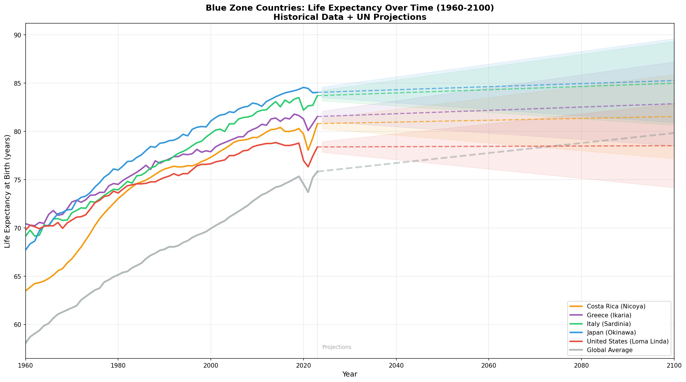
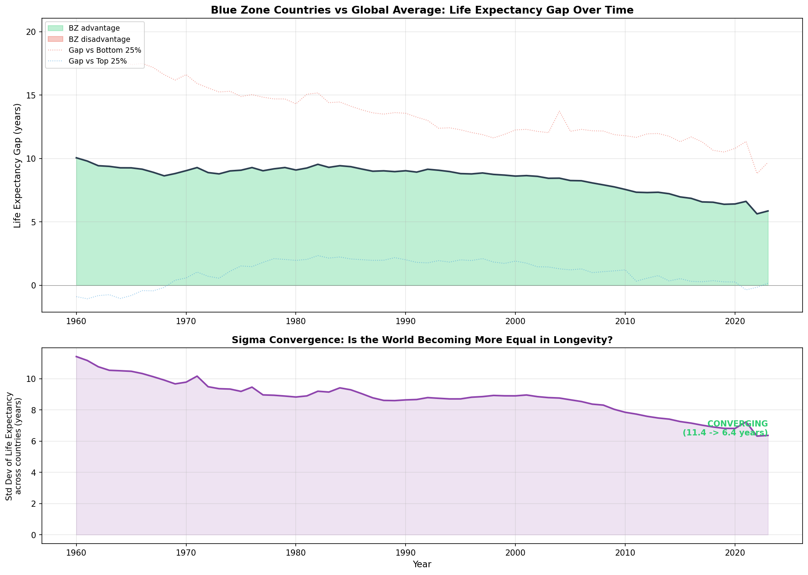
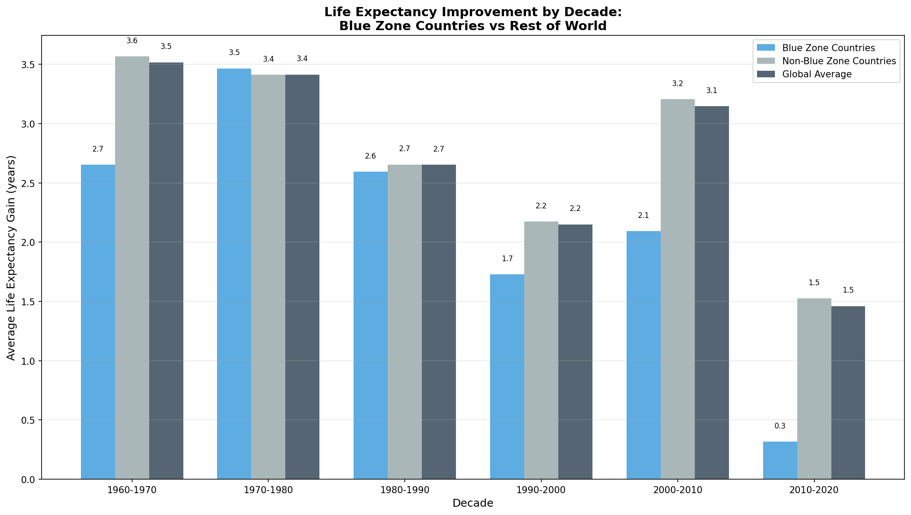
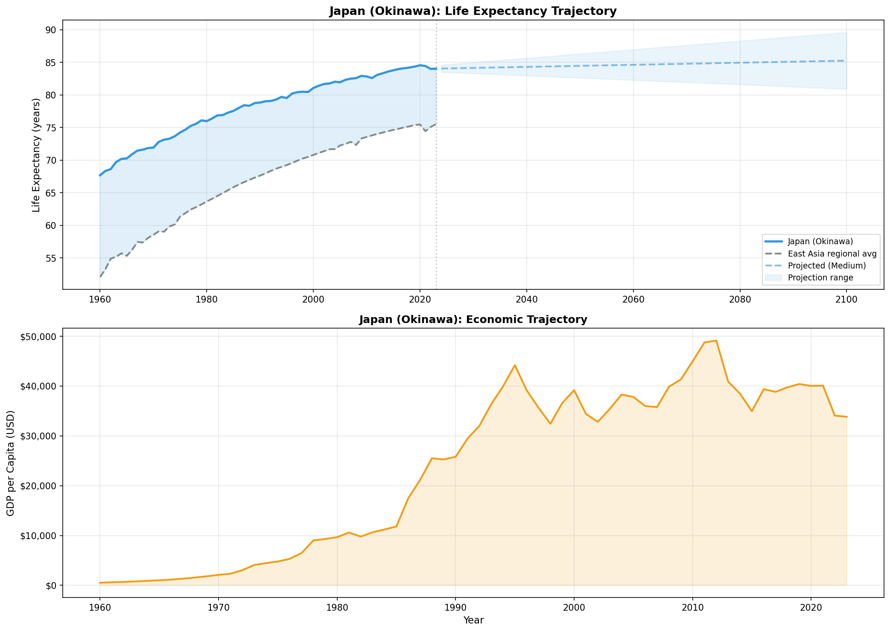
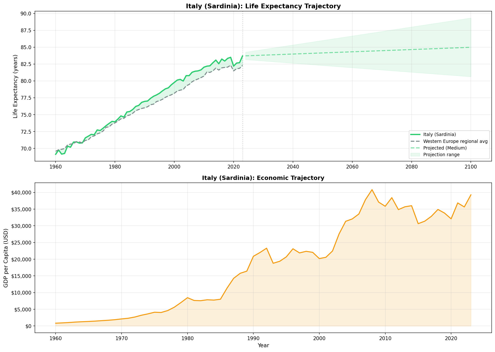
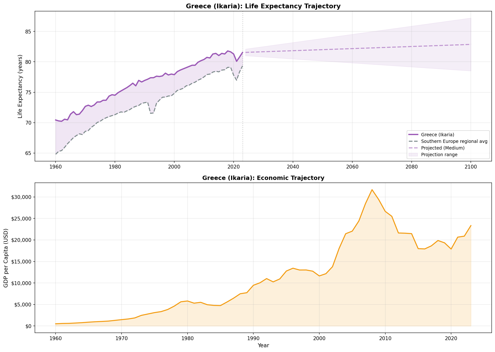
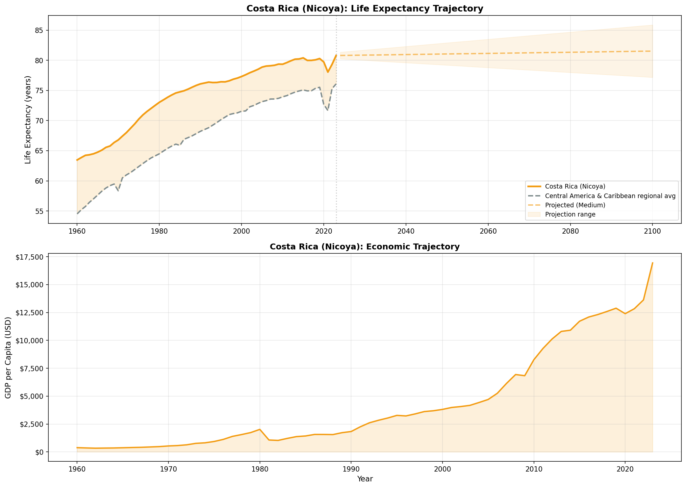
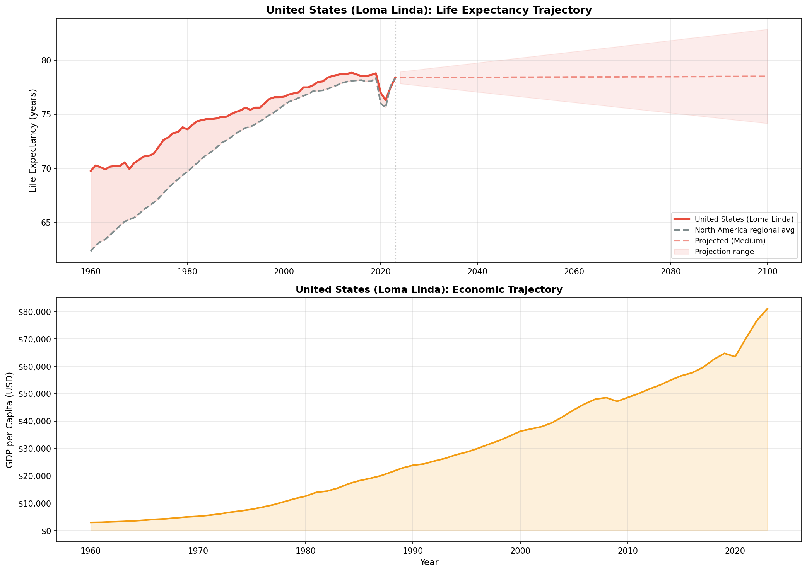
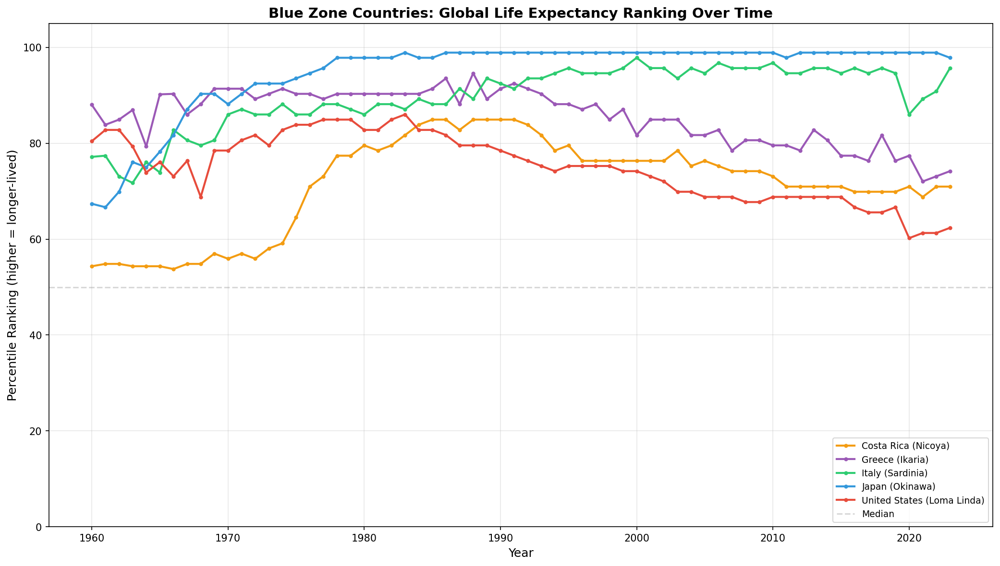

# Blue Zones Longevity Analysis: Historical Trends & Future Projections

**Generated:** 2026-02-08 22:54
**Data Sources:** World Bank API (1960-2023), WHO Global Health Observatory, UN Population Division
**Method:** All data is real - no synthetic or fake data used

---
## Executive Summary

This analysis examines **93 countries** across **64 years** (1960-2023) using **5,952 data points** from the World Bank and WHO APIs.

**Key Findings:**

1. **Blue Zone countries currently lead the global average by 5.9 years** in life expectancy
2. **The gap is narrowing** - from 10.0 years in the 1960s to 5.9 years today (global convergence)
3. **Global convergence confirmed** - the standard deviation of life expectancy across countries has decreased from 11.4 to 6.4 years

4. **Data quality massively improved** - previous dataset had data for only 1 of 5 Blue Zone countries (Costa Rica). This update provides historical data for all 5 Blue Zone countries.

> **Important Limitation:** Blue Zones are specific *regions* within countries (Okinawa, Sardinia, Ikaria, Nicoya, Loma Linda), not entire countries. This analysis tracks country-level data from public APIs. Japan's national life expectancy does not equal Okinawa's specifically.

---
## Data Overview

### Dataset Statistics

| Metric | Value |
|--------|-------|
| Total country-year observations | 5,952 |
| Countries | 93 |
| Year range | 1960 - 2023 |
| Blue Zone countries | 5 |

### Data Completeness

| Indicator | % Filled | Earliest Year |
|-----------|----------|---------------|
| life_expectancy | 99.9% | 1960 |
| gdp_per_capita | 89.1% | 1960 |
| physicians_per_1000 | 53.6% | 1960 |
| urban_population_pct | 100.0% | 1960 |
| pm25_air_pollution | 48.4% | 1990 |
| health_expenditure_pc | 36.8% | 2000 |
| death_rate | 100.0% | 1960 |
| forest_area_pct | 51.8% | 1990 |

### Blue Zone Country Data Coverage

| Country | Blue Zone Region | Years with LE Data | LE Range |
|---------|-----------------|-------------------|----------|
| Costa Rica | Nicoya | 64 | 63.5 - 80.8 |
| Greece | Ikaria | 64 | 70.2 - 81.8 |
| Italy | Sardinia | 64 | 69.1 - 83.7 |
| Japan | Okinawa | 64 | 67.7 - 84.6 |
| United States | Loma Linda | 64 | 69.8 - 78.8 |

---
## Historical Trends: Blue Zone Countries vs World

### Life Expectancy by Decade

| Year | Blue Zone Avg | Global Avg | Gap | Countries |
|------|--------------|------------|-----|-----------|
| 1960 | 68.1 | 58.0 | +10.0 | 92 |
| 1970 | 70.8 | 61.7 | +9.0 | 93 |
| 1980 | 74.2 | 65.1 | +9.1 | 93 |
| 1990 | 76.8 | 67.8 | +9.0 | 93 |
| 2000 | 78.5 | 69.9 | +8.6 | 93 |
| 2010 | 80.6 | 73.1 | +7.6 | 93 |
| 2020 | 80.9 | 74.5 | +6.4 | 93 |

---
## Convergence Analysis

### Beta Convergence by Decade

The question: Are countries that started with lower life expectancy catching up faster?

| Decade | Avg LE Gain | BZ Countries Gain | Rest of World Gain | Convergence? |
|--------|-------------|-------------------|--------------------|-------------|
| 1960s | 3.5 yr | 2.7 yr | 3.6 yr | Yes |
| 1970s | 3.4 yr | 3.5 yr | 3.4 yr | Yes |
| 1980s | 2.7 yr | 2.6 yr | 2.7 yr | Yes |
| 1990s | 2.2 yr | 1.7 yr | 2.2 yr | Weak |
| 2000s | 3.1 yr | 2.1 yr | 3.2 yr | Yes |
| 2010s | 1.5 yr | 0.3 yr | 1.5 yr | Yes |

---
## Improvement Rates by Decade

---
## Blue Zone Country Profiles

### Japan

- Life expectancy range: 67.7 - 84.6 years
- Total improvement: 16.9 years

### Italy

- Life expectancy range: 69.1 - 83.7 years
- Total improvement: 14.6 years

### Greece

- Life expectancy range: 70.2 - 81.8 years
- Total improvement: 11.6 years

### Costa Rica

- Life expectancy range: 63.5 - 80.8 years
- Total improvement: 17.3 years

### United States

- Life expectancy range: 69.8 - 78.8 years
- Total improvement: 9.1 years

---
## Global Life Expectancy Heatmap

---
## Blue Zone Country Rankings Over Time

---
## Future Projections

**Projection source:** trend_extrapolation_from_real_data

### 2050 Projections

| Country | Medium | High | Low |
|---------|--------|------|-----|
| Japan | 84.5 | 86.3 | 82.6 |
| Italy | 84.2 | 86.0 | 82.3 |
| Greece | 82.0 | 83.8 | 80.2 |
| Costa Rica | 81.1 | 82.9 | 79.2 |
| United States | 78.4 | 80.3 | 76.6 |

---
## Limitations & Caveats

1. **Country-level vs Region-level:** Blue Zones are specific communities/regions, not entire countries. Okinawa's life expectancy differs from Japan's national average. This analysis uses country-level data because sub-national historical time series are not available from public APIs.

2. **Data Gaps:** World Bank data completeness varies by indicator and country. Some indicators (PM2.5, health expenditure) only have data from ~2000 onward. Not all countries report all indicators every year.

3. **Projection Uncertainty:** Future projections (whether from UN or trend extrapolation) are model outputs with inherent uncertainty. The actual future may fall outside the projected ranges.

4. **No Causal Claims:** Correlations between health indicators and life expectancy do not prove causation. All analysis is observational.

5. **Sample Bias:** The 93-country sample skews toward larger countries with better statistical infrastructure. Smaller nations with potentially interesting longevity patterns may be absent.

6. **Recent Blue Zone Research:** Some researchers have questioned whether certain Blue Zones (particularly Okinawa) are losing their longevity advantage due to dietary westernization and lifestyle changes. Country-level data cannot capture these intra-country shifts.

---
## Methodology

### Data Collection
- **World Bank API:** REST API calls for 9 indicators across 93 countries, 1960-2023, with proper pagination and rate limiting
- **WHO GHO API:** Life expectancy, maternal mortality, infant mortality with full historical data
- **UN Population Division:** World Population Prospects 2024 projections through 2100

### Analysis Methods
- **Gap Analysis:** Simple difference between Blue Zone country average and global average life expectancy per year
- **Sigma Convergence:** Standard deviation of life expectancy across countries per year (decreasing SD = convergence)
- **Beta Convergence:** Correlation between initial life expectancy and subsequent gains by decade
- **Improvement Velocity:** Average life expectancy gain per decade by country group

### Tools
- Python 3, pandas, numpy, matplotlib, requests
- All code is reproducible - see the scripts in the project root

---
*Report generated automatically from real-world data.*

*Date: 2026-02-08*
