# Blue Zones Longevity Analysis

### A longitudinal study of life expectancy trends in Blue Zone countries vs the global population, 1960-2023, with statistical significance testing, GDP-controlled correlations, and pre-COVID/full-period comparison.

[](https://xxremsteelexx-blue-zones-longevity--blue-zones-dashboard-xgbvew.streamlit.app/)

---

## Background

In 2004, Dan Buettner and a team of demographers identified five regions around the world where people consistently live longer than anywhere else. They called them Blue Zones:

| Region | Country | What makes it notable |
|--------|---------|----------------------|
| Okinawa | Japan | Highest concentration of centenarians per capita in the world |
| Sardinia | Italy | Mountain villages with the highest male centenarian ratio globally |
| Ikaria | Greece | An Aegean island where residents reach 90 at 2.5x the US rate |
| Nicoya Peninsula | Costa Rica | Lowest middle-age mortality in the world |
| Loma Linda | United States | Seventh-day Adventist community living ~10 years longer than average Americans |

The question that kicked off this project was straightforward: **if these places have something special, can we see it in the numbers? And is the rest of the world catching up?**

Then COVID-19 hit, and the question changed. The pandemic caused the largest single-year drop in global life expectancy since records began. Suddenly the data had a massive shock right at the end of the time series. The analysis had to be run twice -- once through 2019 (the clean trend) and once through 2023 (the full truth) -- to separate what the world was doing from what the virus did to it.

This isn't a study of the Blue Zone regions themselves -- Okinawa doesn't publish a 60-year life expectancy time series to a public API. What we *can* do is track the **countries** that contain Blue Zones using World Bank and WHO data going back to 1960, compare them against 88 other countries, and see what the trend lines actually say.

---

## Hypotheses

**Primary hypothesis (H1):** Blue Zone countries have maintained a persistent and statistically meaningful life expectancy advantage over the global average across the period 1960-2023.

**Secondary hypothesis (H2):** The gap between Blue Zone countries and the rest of the world is narrowing over time (global convergence).

**Null hypothesis (H0):** There is no significant difference between Blue Zone country life expectancy and the global average, or the gap has remained constant.

---

## Dataset

All data was pulled directly from public APIs. No synthetic or fabricated data was used at any point.

| Source | Indicators | Coverage |
|--------|-----------|----------|
| World Bank REST API | Life expectancy (overall, male, female), GDP per capita, physicians per 1000, PM2.5, urbanization, health expenditure, death rate, forest area, population, fertility rate, population 65+, Gini index, clean water access, alcohol consumption | 93 countries, 1960-2023 |
| World Bank REST API (extended) | Adult literacy, tertiary enrollment, internet users, land area, measles immunization, suicide rate, GNI per capita | 93 countries, variable coverage |
| Static geographic references | Mean annual temperature, mean elevation | 93 countries |
| WHO Global Health Observatory | Life expectancy (cross-validation) | 93 countries, variable coverage |

**Historical panel:** 5,952 country-year observations across 93 countries and 64 years (1960-2023), with 24 variables per observation.

**ML feature matrix:** 93 countries x 36 features (cross-sectional, most recent values 2015-2023), used for predictive modeling.

All five Blue Zone countries have **100% life expectancy coverage** -- 64 consecutive years of data each, including male and female breakdowns.

The analysis is run twice on purpose:
- **Pre-COVID (1960-2019):** 60 years of clean secular trends, no pandemic noise
- **Full period (1960-2023):** The honest picture, including COVID disruption and recovery


---

## Results: Pre-COVID Analysis (1960-2019)

This is the clean dataset. Sixty years of data with no pandemic distortion.

### H1: The Blue Zone Advantage is Real and Statistically Significant

Blue Zone countries have led the global average in every single year since 1960. The gap was **10.6 years** in 1960 and stood at **6.7 years** as of 2019.

| Year | Blue Zone Avg (years) | Global Avg (years) | Gap | 95% CI | p-value |
|------|----------------------|-------------------|-----|--------|---------|
| 1960 | 68.1 | 57.5 | **+10.6** | [8.3, 12.9] | 0.000 |
| 1970 | 70.8 | 61.3 | **+9.4** | [7.3, 11.5] | 0.001 |
| 1980 | 74.2 | 64.7 | **+9.5** | [7.5, 11.4] | 0.001 |
| 1990 | 76.8 | 67.5 | **+9.3** | [7.4, 11.1] | 0.001 |
| 2000 | 78.5 | 69.6 | **+9.0** | [7.2, 10.7] | 0.001 |
| 2010 | 80.6 | 72.9 | **+7.7** | [5.9, 9.5] | 0.002 |
| 2019 | 81.7 | 75.0 | **+6.7** | [4.5, 9.0] | 0.003 |

Bootstrap confidence intervals (1,000 resamples) confirm the gap is **significant at p<0.05 for all 64 years** analyzed. The probability of 5 random countries showing this gap by chance is below 1% in every year.

**H1 is supported with statistical significance.**


### H2: The World is Catching Up (Convergence Confirmed with P-values)

The gap shrank from 10.6 years to 6.7 years -- a **37% reduction** over six decades. This isn't because Blue Zone countries got worse. It's because the rest of the world improved faster.

**Sigma convergence:** The standard deviation of life expectancy across all 93 countries dropped continuously. OLS regression confirms this is statistically significant:

| Period | Slope (SD/year) | R-squared | p-value | Bartlett's p |
|--------|----------------|-----------|---------|--------------|
| Pre-COVID (1960-2019) | -0.053 | 0.846 | <0.001 | 0.001 |
| Full period (1960-2023) | -0.056 | 0.866 | <0.001 | <0.001 |


**Beta convergence:** Pearson correlations with Bonferroni correction for 6 simultaneous tests:

| Decade | BZ Gain | Non-BZ Gain | Beta r | p (Bonferroni) | Significant? | Cohen's d |
|--------|---------|-------------|--------|---------------|-------------|-----------|
| 1960s | +2.7 yr | +3.6 yr | -0.575 | <0.001 | Yes | -0.26 (small) |
| 1970s | +3.5 yr | +3.4 yr | -0.450 | <0.001 | Yes | 0.02 (small) |
| 1980s | +2.6 yr | +2.7 yr | -0.213 | 0.242 | No | -0.02 (small) |
| 1990s | +1.7 yr | +2.2 yr | -0.088 | 1.000 | No | -0.15 (small) |
| 2000s | +2.1 yr | +3.2 yr | -0.652 | <0.001 | Yes | -0.62 (medium) |
| 2010s | +1.1 yr | +2.3 yr | -0.641 | <0.001 | Yes | -0.68 (medium) |

Convergence was significant in 4 of 6 decades. The 1980s-1990s pause coincides with the HIV/AIDS crisis in Africa and the post-Soviet collapse, which temporarily interrupted global progress.

In the 2000s and 2010s, non-BZ countries gained significantly more than BZ countries (Cohen's d = -0.62 and -0.68, medium effect sizes), confirming accelerating convergence.

**H2 is supported.** Global convergence is real and statistically validated.


**H0 is rejected.** The difference is significant and the convergence trend is consistent.

---

## Results: Full Period (1960-2023) and COVID Impact

Then COVID happened.

### The Shock

The pandemic caused the largest single-year reversal in global life expectancy since the data begins:

| Metric | Value |
|--------|-------|
| Global average drop, 2019 to 2020 | **-0.79 years** |
| Global average drop, 2019 to 2021 | **-1.64 years** |
| Worst hit country | Ecuador (-5.28 years in one year) |
| Countries with LE drops in 2020 | 78 out of 93 |
| Countries recovered by 2023 | 75 out of 93 |

**Structural break confirmed:** A Chow test at 2020 detects a statistically significant structural break in the BZ gap time series (F=10.82, p<0.001). The 2022 gap of 5.95 years fell outside the prediction interval from the pre-COVID trend.

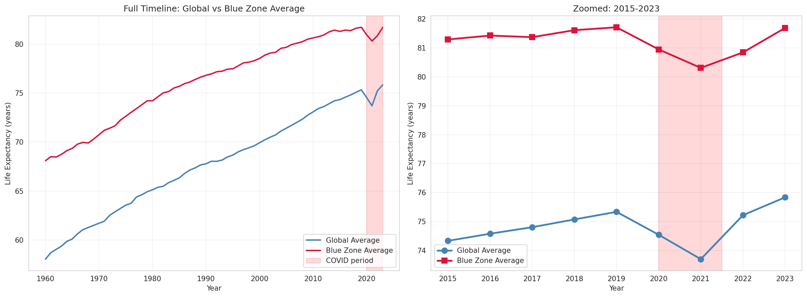

### Blue Zone Countries Were Not Spared

COVID hit Blue Zone countries unevenly. The United States was devastated. Japan barely noticed.

| Country | LE 2019 | LE 2020 | Drop | LE 2023 | Net Change |
|---------|---------|---------|------|---------|------------|
| United States | 78.8 | 77.0 | **-1.81** | 78.4 | -0.40 (still below 2019) |
| Italy | 83.5 | 82.2 | **-1.30** | 83.7 | +0.20 (recovered) |
| Costa Rica | 80.3 | 79.7 | **-0.57** | 80.8 | +0.50 (recovered) |
| Greece | 81.6 | 81.3 | **-0.35** | 81.5 | -0.10 (still below 2019) |
| Japan | 84.4 | 84.6 | **+0.20** | 84.0 | -0.32 (declined post-2020) |

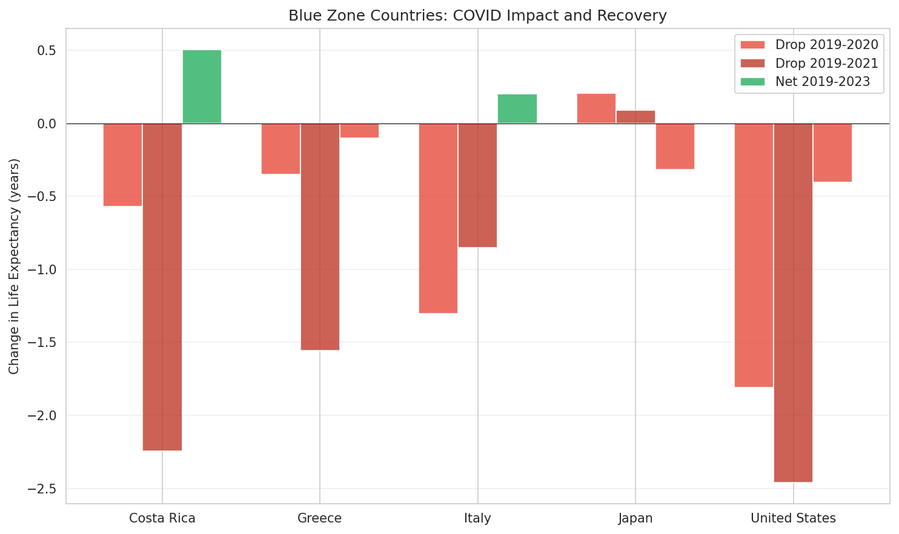

### All Blue Zone Countries Overlaid: COVID Years Zoomed

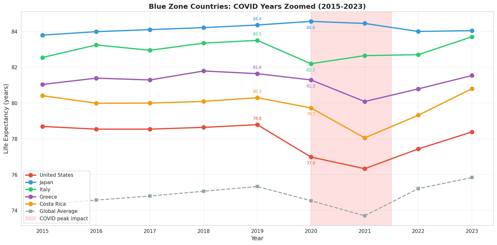

### Recovery Trajectory: Change Relative to 2019

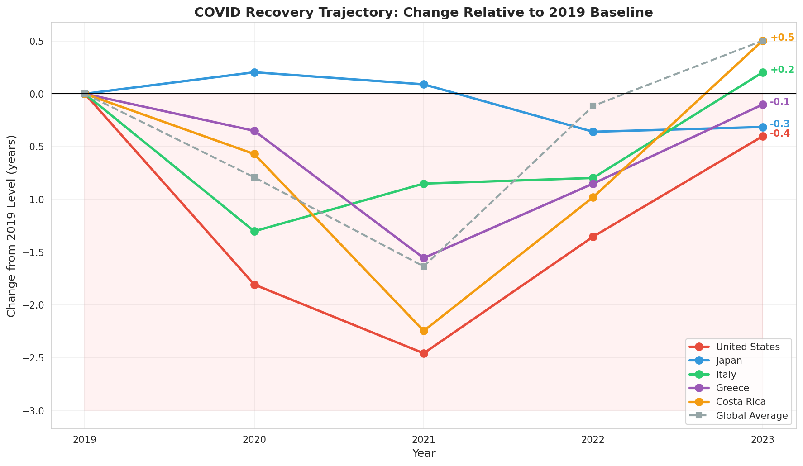

### What COVID Did to the Convergence Story

**Pre-COVID gap (2019):** 6.7 years. **Full period gap (2023):** 6.2 years.

COVID actually **accelerated convergence by 0.5 years**. The 2022 gap fell outside the pre-COVID trend prediction interval, indicating the pandemic compressed the gap faster than the secular trend alone would have.

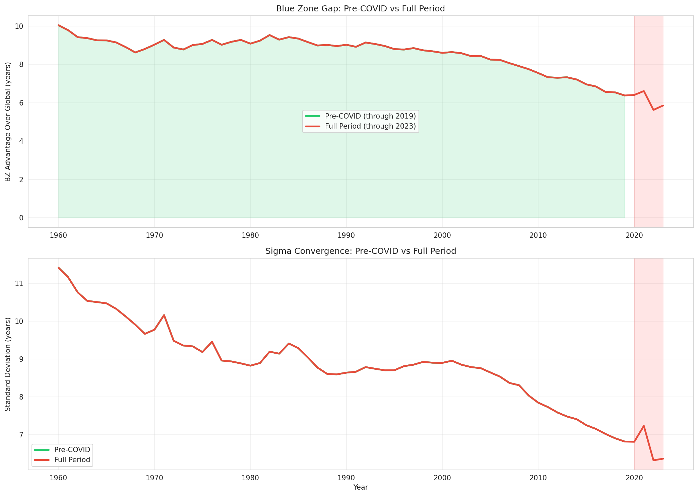

### Trend vs Reality

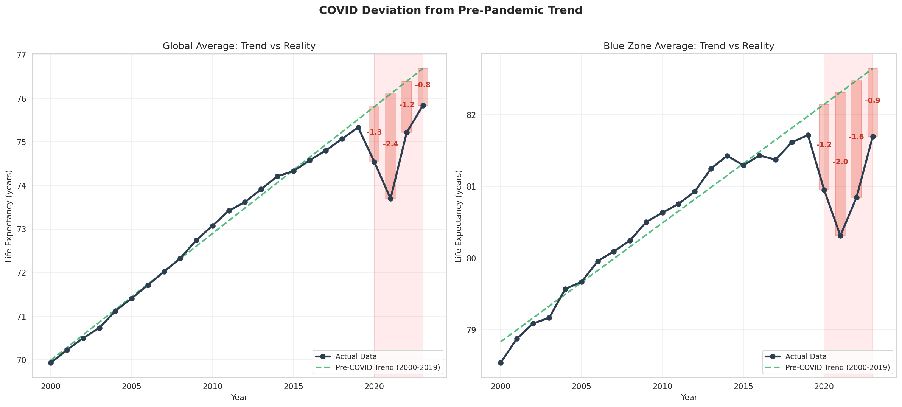

---

## Statistical Significance and Controls

### GDP-Controlled Partial Correlations

Raw correlations can be misleading because wealthy countries tend to score better on everything. Partial correlations control for GDP per capita to reveal which relationships with life expectancy are independent of wealth.

| Indicator | Raw r | GDP-Controlled r | GDP Explains? |
|-----------|-------|-------------------|---------------|
| Fertility rate | -0.820 | -0.762 | No |
| Clean water access | +0.854 | +0.752 | No |
| Physicians per 1000 | +0.837 | +0.682 | No |
| Population 65+ (%) | +0.774 | +0.647 | No |
| Urbanization (%) | +0.681 | +0.514 | No |
| **Gini index** | -0.341 | **-0.147** | **Yes** |
| **Health expenditure/capita** | +0.640 | **+0.058** | **Yes** |

**Key finding:** Health expenditure per capita has almost zero independent correlation with life expectancy after controlling for GDP (partial r=0.058). The raw correlation of 0.640 is entirely driven by wealthier countries spending more. Gini index shows the same pattern.

Physician density (r=0.682 after GDP control), clean water access (r=0.752), and fertility rate (r=-0.762) remain strongly correlated with LE independent of wealth.

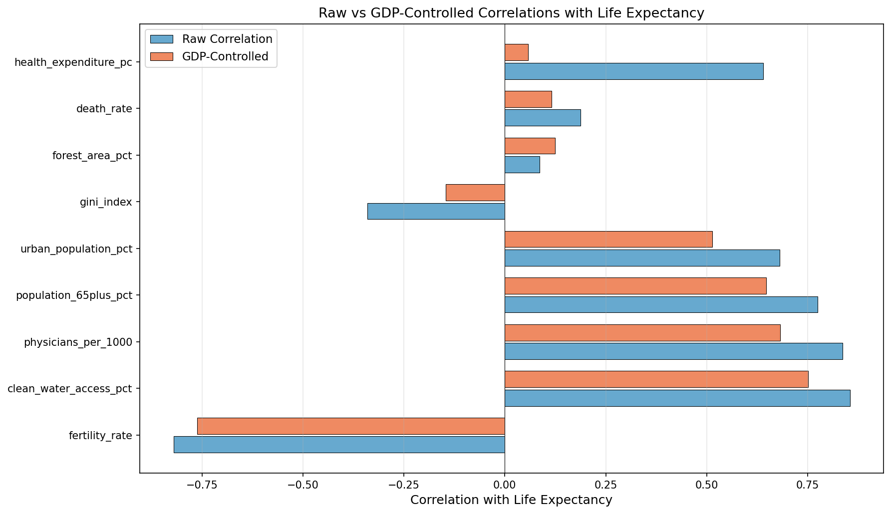

### Multiple Regression

OLS regression: `life_expectancy ~ GDP + physicians + urbanization + health_expenditure`

| Metric | Value |
|--------|-------|
| R-squared | 0.706 |
| Adjusted R-squared | 0.693 |
| F-statistic p-value | <0.001 |
| N observations | 92 countries |

| Predictor | Coefficient | p-value | Significant? |
|-----------|------------|---------|-------------|
| Physicians per 1000 | +1.787 | <0.001 | Yes |
| Urbanization (%) | +0.082 | 0.002 | Yes |
| GDP per capita | +0.0001 | 0.041 | Yes |
| Health expenditure/capita | -0.0001 | 0.827 | No |

No problematic multicollinearity (all VIF < 10).

### Confidence Intervals on the BZ Gap

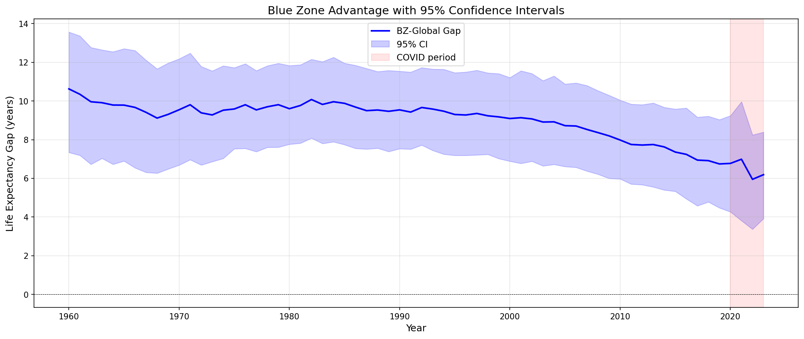

---

## Sensitivity Analysis

### Drop-One-Country Test

How robust is the BZ advantage to removing any single country?

| Dropped Country | LE 2019 | New Gap | Change | Effect |
|----------------|---------|---------|--------|--------|
| United States | 78.8 | 7.48 | **+0.73** | Gap increases -- USA drags BZ average down |
| Japan | 84.4 | 6.08 | **-0.66** | Gap decreases -- Japan is the strongest member |
| Italy | 83.5 | 6.30 | **-0.45** | Moderate decrease |
| Costa Rica | 80.3 | 7.10 | **+0.35** | Moderate increase |
| Greece | 81.6 | 6.76 | **+0.02** | Negligible effect |

**The BZ advantage is robust.** No single country removal eliminates the gap. The gap ranges from 6.08 to 7.48 years regardless of which country is dropped.

The USA is the weakest link -- removing it increases the BZ advantage by 0.73 years. Japan is the strongest -- removing it reduces the advantage by 0.66 years.

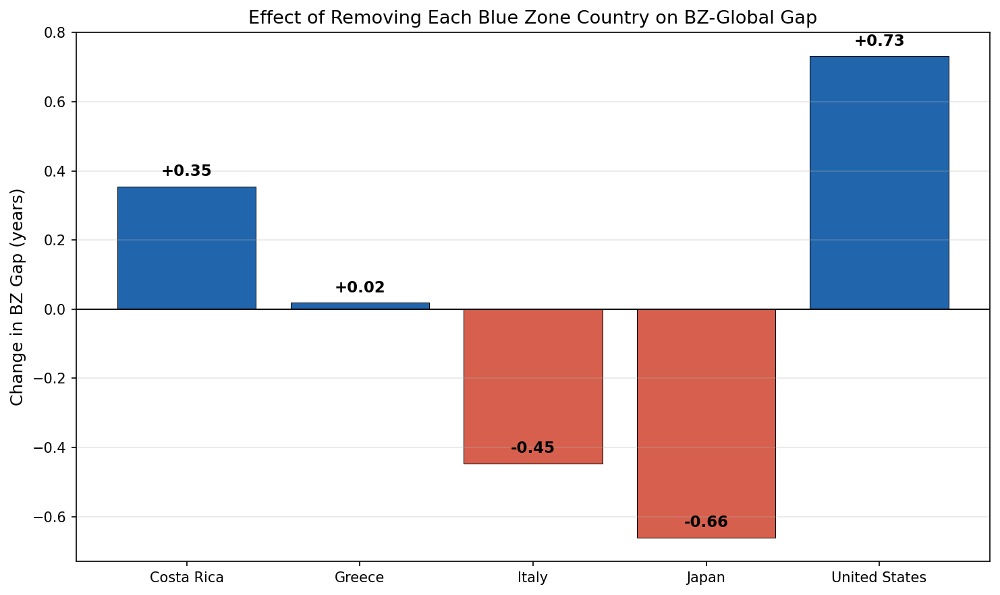

### Population-Weighted vs Unweighted Averages

Population-weighted averages give more influence to large countries (China, India, Indonesia) that tend to have lower LE. This increases the apparent BZ advantage:

| Year | Unweighted Gap | Population-Weighted Gap | Difference |
|------|---------------|------------------------|------------|
| 2019 | 6.74 years | 7.66 years | +0.92 |
| 2023 | 6.19 years | 6.80 years | +0.61 |

The unweighted analysis is more conservative. Both methods confirm a significant BZ advantage.

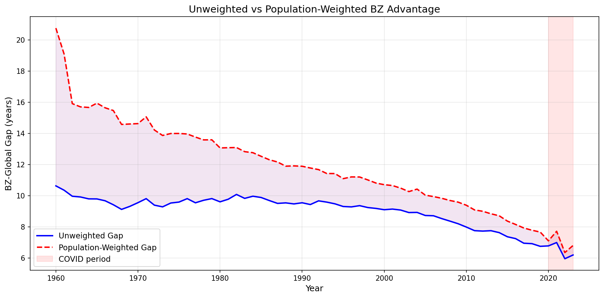

---

## Gender Analysis

Male and female life expectancy tracked separately reveals the BZ advantage is **nearly identical for both sexes**.

| Metric (2019) | Male | Female |
|--------------|------|--------|
| BZ average | 79.2 years | 84.3 years |
| Global average | 72.4 years | 77.7 years |
| BZ advantage | 6.8 years | 6.7 years |
| Gender gap (F-M) in BZ | 5.2 years | - |
| Gender gap (F-M) globally | 5.3 years | - |

The BZ advantage does not favor one sex over the other. The gender gap within BZ countries (female - male) is nearly identical to the global pattern.

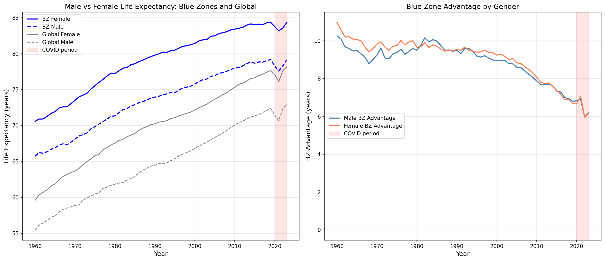

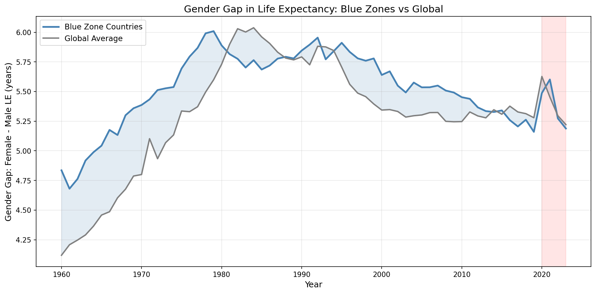

---

## Regional Peer Comparison

Each BZ country compared to the average of its geographic region (2000-2019):

| BZ Country | Region | Advantage Over Regional Mean | Regional Outlier? |
|-----------|--------|------------------------------|-------------------|
| Japan | East Asia & Pacific | **+9.7 years** | Yes (p<0.001) |
| Costa Rica | Central & South America | **+5.5 years** | Yes (p<0.001) |
| Italy | Southern Europe | **+4.3 years** | Yes (p<0.001) |
| Greece | Southern Europe | **+2.5 years** | Yes (p<0.001) |
| **United States** | **N. America & W. Europe** | **-2.5 years** | **No -- below average** |

**Japan, Italy, Greece, and Costa Rica are all statistically significant outliers above their regional peer averages.** The United States is 2.5 years *below* the average for North America and Western Europe.

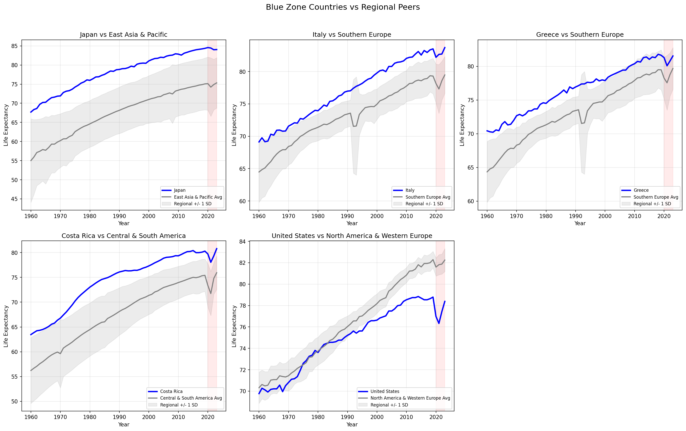

---

## Income Group Convergence

Countries classified by World Bank income thresholds (2019 GDP per capita):

| Income Group | Countries | LE Improvement (1960-2023) | Within-Group Convergence? |
|-------------|-----------|---------------------------|--------------------------|
| Low income | 7 | +20.1 years | Yes (sigma declining) |
| Lower-middle income | 21 | +19.1 years | No |
| Upper-middle income | 27 | +14.5 years | No |
| High income | 38 | +11.5 years | Yes (sigma declining) |

Low-income countries had the largest LE gains (+20.1 years) but the lower-middle income group has not converged internally -- there is still wide dispersion. High-income countries have strong within-group convergence.

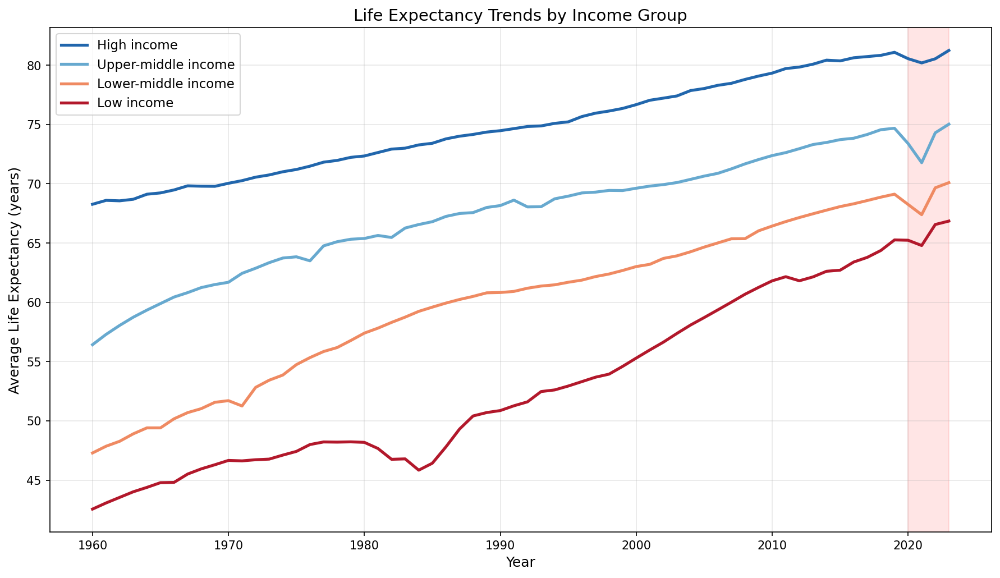

---

## Country-Level Recovery

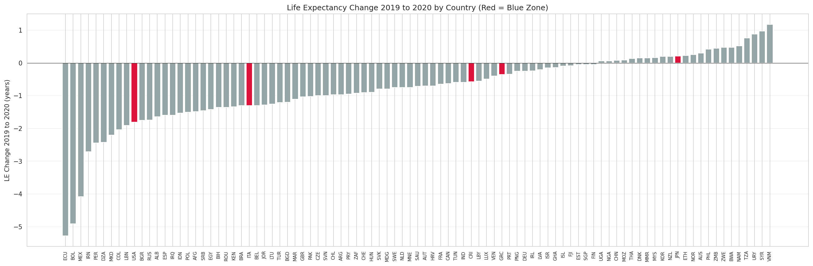

By 2023, 75 out of 93 countries had recovered to at or above their 2019 life expectancy. The 18 that hadn't include the United States.

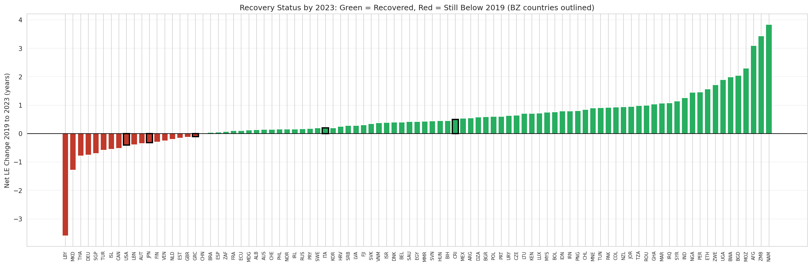

---

## Individual Blue Zone Country Trajectories


### Japan (Okinawa)
- **1960:** 67.7 years | **2019:** 84.4 years | **2023:** 84.0 years | **Gain:** +16.7 years
- The single highest life expectancy among all Blue Zone countries. Japan is the strongest regional outlier at +9.7 years above the East Asian average.

### Italy (Sardinia)
- **1960:** 69.1 years | **2019:** 83.5 years | **2023:** 83.7 years | **Gain:** +14.4 years
- Took a hard COVID hit (-1.30 years) but fully recovered by 2023. A significant outlier in Southern Europe at +4.3 years above regional average.

### Costa Rica (Nicoya)
- **1960:** 63.5 years | **2019:** 80.3 years | **2023:** 80.8 years | **Gain:** +16.8 years
- The most impressive catch-up story. Started 6 years below the other BZ countries and nearly closed the gap. Recovered from COVID with room to spare. +5.5 years above Central & South American average.

### Greece (Ikaria)
- **1960:** 70.4 years | **2019:** 81.6 years | **2023:** 81.5 years | **Gain:** +11.2 years
- Started above the global average but has been overtaken by Japan and Italy. Still a regional outlier at +2.5 years above Southern European average.

### United States (Loma Linda)
- **1960:** 69.8 years | **2019:** 78.8 years | **2023:** 78.4 years | **Gain:** +9.0 years
- The worst performer among Blue Zone countries by a wide margin. Gained only 9.0 years over 60 years while Japan gained 16.7. Hit hardest by COVID (-1.81 years) and still hasn't recovered. Falls 2.5 years below the North America/Western Europe average. Removing the USA from the BZ group increases the gap by 0.73 years. Whatever Loma Linda is doing right is entirely invisible at the national level.


---

## GDP vs Life Expectancy

The relationship between wealth and longevity is real but has diminishing returns. Costa Rica achieves nearly the same life expectancy as the US at a fraction of the GDP per capita. After controlling for GDP, health expenditure per capita has virtually no independent correlation with LE (partial r = 0.058).


---

## Decade-by-Decade Improvement Rates


---

## Global Rankings Over Time

Japan has held a top-5 position for decades. The US has been sliding -- it was in the top quartile in the 1960s and has dropped steadily since.


---

## Cross-Indicator Correlations

Raw correlations (2015+ cross-sectional data):

| Factor | Correlation with LE | Direction |
|--------|-------------------|-----------|
| Clean water access | r = +0.854 | Better sanitation, longer lives |
| Physicians per 1,000 | r = +0.837 | More doctors, longer lives |
| Fertility rate | r = -0.820 | Lower fertility, longer lives |
| Population 65+ | r = +0.774 | Demographic indicator of longevity |
| Urbanization (%) | r = +0.681 | More urban, longer lives |
| Health expenditure/capita | r = +0.640 | **Disappears after GDP control** |

After controlling for GDP, **physician density** is the strongest independent predictor (partial r = 0.682, regression beta = +1.79 years per physician per 1000, p<0.001). Health expenditure per capita is not independently significant.


---

## Global Life Expectancy Distribution Over Time


---

## Time-Series Tests

| Test | Statistic | p-value | Conclusion |
|------|-----------|---------|-----------|
| ADF: Global LE level | -2.82 | 0.056 | Non-stationary (trending upward) |
| ADF: Global LE first differences | -4.10 | 0.001 | Stationary after differencing |
| Chow structural break at 2020 | F=10.82 | <0.001 | **Structural break confirmed** |
| ADF: BZ gap series | 2.11 | 0.999 | Non-stationary (gap has a trend) |

The Chow test confirms that 2020 introduced a structural break in the BZ gap time series. The gap's behavior after 2020 is fundamentally different from the pre-2020 trend.

---

## Projections (2024-2100)

Life expectancy projections through 2100, extrapolated from real historical trends with logistic dampening (approaching a theoretical ceiling around 95 years). These are trend-based estimates, not official UN projections (UN WPP 2024 data requires authenticated access and was not available for benchmarking).

| Country | 2050 Medium | 2050 Range | Source |
|---------|------------|------------|--------|
| Japan | 84.5 yr | 82.6 - 86.3 | Trend extrapolation |
| Italy | 84.2 yr | 82.3 - 86.0 | Trend extrapolation |
| Greece | 82.0 yr | 80.2 - 83.8 | Trend extrapolation |
| Costa Rica | 81.1 yr | 79.2 - 82.9 | Trend extrapolation |
| United States | 78.4 yr | 76.6 - 80.3 | Trend extrapolation |


---

## Predictive Analysis: Life Expectancy Prediction and Country Overperformance

The descriptive analysis above tells us *what* the data shows. This section asks a different question: **which countries live longer (or shorter) than their measurable indicators predict?**

Using 10 country-level features (selected from 26 candidates via a coverage/correlation/VIF pipeline), five regularized ML models predict life expectancy for each of the 93 countries. The residual (actual - predicted) reveals which countries outperform or underperform their "expected" life expectancy.

### Models Compared (LOOCV, n=93)

| Model | LOOCV R-squared | RMSE (years) | Features Used |
|-------|----------------|-------------|---------------|
| **Random Forest** | **0.683** | **3.56** | 10 |
| Ridge | 0.679 | 3.58 | 10 |
| ElasticNet | 0.678 | 3.59 | 10 |
| OLS Extended | 0.675 | 3.61 | 10 |
| Lasso | 0.636 | 3.82 | 6 |

All models evaluated with Leave-One-Out Cross-Validation (LOOCV) -- the gold standard for small-sample honest prediction.

### Top Features (by Combined Importance)

1. **Fertility rate** (strongest -- Lasso coef: -3.50, RF importance: 0.373)
2. Absolute latitude (distance from equator)
3. Tertiary enrollment
4. PM2.5 air pollution
5. Population density

### Hidden Blue Zone Candidates (Top 10 Overperformers)

Countries that live significantly longer than their indicators predict:

| Rank | Country | Actual LE | Predicted LE | Residual | Known BZ? |
|------|---------|-----------|-------------|----------|-----------|
| 1 | Israel | 83.2 | 73.4 | **+9.8** | No |
| 2 | Japan | 84.0 | 78.2 | **+5.8** | Yes |
| 3 | Saudi Arabia | 78.7 | 73.0 | **+5.8** | No |
| 4 | Luxembourg | 83.4 | 78.2 | **+5.2** | No |
| 5 | Singapore | 82.9 | 77.8 | **+5.1** | No |
| 6 | South Korea | 83.4 | 78.4 | **+5.0** | No |
| 7 | Jordan | 77.8 | 73.0 | **+4.8** | No |
| 8 | Costa Rica | 80.8 | 76.1 | **+4.7** | Yes |
| 9 | Peru | 77.7 | 73.3 | **+4.4** | No |
| 10 | Italy | 83.7 | 79.4 | **+4.3** | Yes |

### Validation Against Known Blue Zones

| BZ Country | Rank (/93) | Residual | Classification |
|------------|-----------|----------|----------------|
| Japan | **2** | +5.84 | Overperformer |
| Costa Rica | **8** | +4.68 | Overperformer |
| Italy | **10** | +4.28 | Overperformer |
| Greece | 27 | +1.89 | As expected |
| United States | 69 | -2.09 | As expected |

3 out of 4 non-US Blue Zone countries are classified as overperformers (z > 1). The USA ranks 69th, consistent with the national-level underperformance documented throughout this analysis.

### Caveats

- **Small sample (n=93):** Results are exploratory, not definitive.
- **Cross-sectional only:** No causal claims -- correlation-based pattern detection.
- **Missing features:** Some important indicators (obesity, NCD mortality) were unavailable from the World Bank API.
- **Country vs region:** Country-level data masks sub-national variation.
- **"Hidden Blue Zone" is a label for statistical overperformance**, not a clinical or demographic designation.

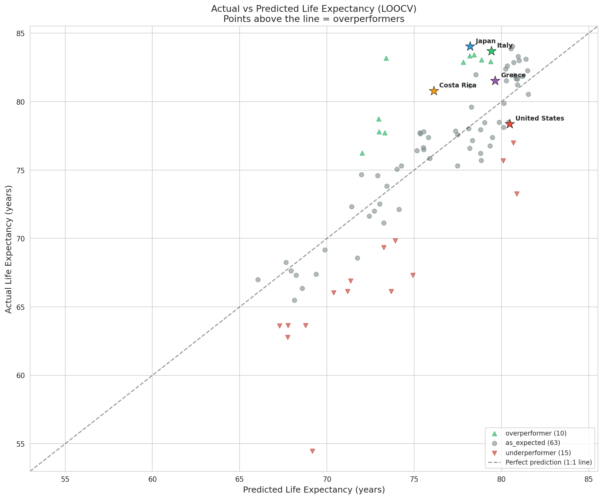

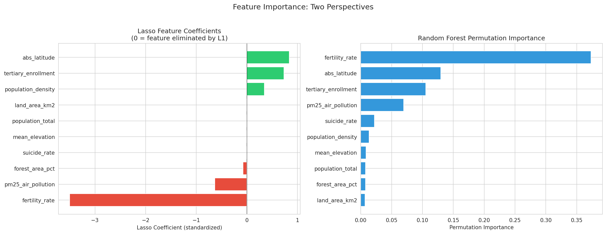

---

## Limitations

1. **The fundamental country-vs-region problem.** Blue Zones are neighborhoods and villages, not nations. Country-level data dilutes the Blue Zone signal. Any conclusions are about countries *containing* Blue Zones, not about the zones themselves.

2. **No causal claims.** All correlations are observational. GDP-controlled partial correlations reduce confounding but do not establish causation. The regression R-squared of 0.71 means 29% of LE variance is unexplained by the model.

3. **COVID distortion.** The pandemic introduced a structural break (confirmed by Chow test). Pre-COVID and full-period analyses are both presented because neither alone tells the complete story.

4. **Projection caveats.** Projections are trend extrapolations, not expert demographic forecasts. UN WPP 2024 data was not available for benchmarking.

5. **Variable coverage.** Life expectancy has near-complete coverage (99.9%). Other indicators are spottier: Gini index (29.4%), alcohol consumption (32.2%), clean water (31.1%). Results using sparse indicators should be interpreted with appropriate caution.

6. **Selection bias.** The 5 Blue Zone countries were identified *because* they had high longevity. Testing whether they have higher LE than average is somewhat circular. The more meaningful findings are about convergence trends, COVID impacts, and controlling for confounds.

7. **The USA paradox.** The US falls below its regional peer average despite containing a Blue Zone. This confirms that country-level data cannot capture localized phenomena like the Loma Linda Adventist community.

---

## Methodology

### Data Collection
- **World Bank API:** REST calls for 16 historical indicators + 14 extended indicators with proper pagination
- **WHO GHO API:** Life expectancy cross-validation
- **Static geographic data:** Mean temperature and elevation from standard references
- **Rate limiting:** 0.3-1.0s between API calls to avoid throttling
- **Merge strategy:** ISO3 country codes

### Statistical Analysis
- **Gap significance:** Bootstrap 95% CI (1,000 resamples), permutation p-values
- **Beta convergence:** Pearson correlation with Bonferroni correction for 6 tests
- **Sigma convergence:** OLS regression of LE standard deviation on year, Bartlett's test
- **COVID structural break:** Chow test at 2020, prediction intervals from OLS on 1990-2019 trend
- **Decade improvements:** Independent t-tests with Cohen's d effect sizes
- **Partial correlations:** Controlling for GDP per capita using the standard formula
- **Multiple regression:** OLS with VIF multicollinearity checks
- **Population weighting:** Numpy weighted average using population_total
- **Sensitivity:** Drop-one-country recalculation of gap and convergence
- **Regional comparison:** Independent t-test of BZ country vs regional peer LE
- **Time-series:** Augmented Dickey-Fuller tests, Chow structural break, ARIMA(1,1,0)

### ML Prediction
- **Feature selection:** 3-stage pipeline (coverage > 50%, correlation < 0.85, VIF < 10)
- **Models:** OLS, Ridge, Lasso, ElasticNet, Random Forest (max_depth=5, min_samples_leaf=5)
- **Evaluation:** Leave-One-Out Cross-Validation (LOOCV) for honest out-of-sample R2
- **Hyperparameter tuning:** RidgeCV, LassoCV, ElasticNetCV with 5-fold inner CV
- **Overperformance detection:** Standardized residuals (z > 1 = overperformer, z < -1 = underperformer)
- **Feature importance:** Combined ranking from Lasso coefficients, RF permutation importance, univariate correlation

### Reproducibility
Every step is scripted and can be re-run:
```bash
python historical_data_collector.py      # Pulls fresh data from APIs (16 WB + WHO)
python un_projections_collector.py       # Generates projections
python covid_comparison_analysis.py      # Runs pre-COVID + full + comparison
python statistical_tests.py             # CIs, p-values, regression, sensitivity, time-series
python gender_analysis.py               # Male/female LE split
python regional_analysis.py             # Regional peers + income groups
python projection_visualizer.py          # Generates figures
python feature_collector.py              # Pulls extended features for ML (14 WB + static)
python ml_prediction.py                  # Trains ML models, residual analysis
```

---

## Interactive Dashboard

The full analysis is available as an interactive Streamlit dashboard with five views:

1. **Pre-COVID (1960-2019):** Clean secular trends without pandemic distortion
2. **Full Period (1960-2023):** The complete picture including COVID and recovery
3. **COVID Impact Comparison:** Side-by-side analysis of what the pandemic changed
4. **Statistical Deep Dive:** Partial correlations, regression, sensitivity, regional, gender
5. **Predictive Analysis:** ML models, feature importance, overperformance map, hidden Blue Zones

**[Launch the Live Dashboard](https://xxremsteelexx-blue-zones-longevity--blue-zones-dashboard-xgbvew.streamlit.app/)**

To run locally:
```bash
pip install -r requirements.txt
streamlit run blue_zones_dashboard.py
```

---

## Project Structure

```
Blue-Zones-Longevity-Analysis/
├── historical_data_collector.py         # World Bank + WHO data collection (16 indicators)
├── feature_collector.py                # Extended feature collection (14 WB + static)
├── ml_prediction.py                    # ML models, LOOCV, overperformance analysis
├── un_projections_collector.py          # Projection generator
├── covid_comparison_analysis.py         # Pre-COVID vs full period analysis
├── historical_trend_analysis.py         # Convergence and trend analysis
├── statistical_tests.py                # CIs, p-values, partial correlations, regression,
│                                       # population weighting, sensitivity, time-series
├── gender_analysis.py                  # Male/female LE split analysis
├── regional_analysis.py                # Regional peer comparison + income groups
├── projection_visualizer.py             # Static figure generation
├── verify_data_quality.py               # Automated quality checks
├── blue_zones_dashboard.py              # Interactive Streamlit dashboard (5 tabs)
│
├── data/
│   ├── historical/
│   │   └── merged_historical_panel.csv  # 5,952 rows, 24 columns
│   ├── features/
│   │   ├── ml_feature_matrix.csv        # 93 rows, 36 columns (ML input)
│   │   └── expanded_panel.csv           # Full panel with extended features
│   └── projections/
│       └── un_life_expectancy_projections.csv
│
├── notebooks/
│   ├── 01_Data_Exploration.ipynb        # Dataset overview (24 variables)
│   ├── 02_Historical_Trends.ipynb       # BZ vs global over time
│   ├── 03_Convergence_Analysis.ipynb    # Sigma and beta convergence
│   ├── 04_Country_Deep_Dives.ipynb      # Individual country profiles
│   ├── 05_Projections_Analysis.ipynb    # Future projections
│   ├── 06_COVID_Comparison.ipynb        # Pre-COVID vs full period + structural break
│   ├── 07_Statistical_Deep_Dive.ipynb   # CIs, partial correlations, sensitivity, gender,
│   │                                    # regional peers, income groups, time-series
│   └── 08_ML_Prediction.ipynb           # ML models, overperformance, hidden Blue Zones
│
└── outputs/
    ├── analysis/
    │   ├── pre_covid/                   # Period-specific analysis CSVs
    │   ├── full_period/                 # Period-specific analysis CSVs
    │   ├── covid_comparison/            # COVID impact analysis
    │   ├── gap_confidence_intervals.csv # Bootstrap CIs and p-values
    │   ├── partial_correlations.csv     # Raw vs GDP-controlled correlations
    │   ├── regression_results.csv       # OLS regression coefficients
    │   ├── sensitivity_drop_one.csv     # Drop-one-country robustness
    │   ├── gender_gap_analysis.csv      # Male/female LE comparison
    │   ├── regional_peer_comparison.csv # BZ vs regional peers
    │   ├── income_group_convergence.csv # Convergence within income groups
    │   ├── time_series_tests.csv        # ADF, Chow, ARIMA results
    │   ├── ml_model_comparison.csv      # ML model LOOCV metrics
    │   ├── ml_feature_importance.csv    # Combined feature importance rankings
    │   ├── ml_residual_analysis.csv     # Full 93-country residual analysis
    │   ├── ml_hidden_blue_zones.csv     # Top 15 overperformers
    │   └── ml_underperformers.csv       # Bottom 15 underperformers
    └── figures/                         # 50+ charts
```

---

## Conclusions

The data tells two stories depending on where you cut it.

**The 60-year secular trend (1960-2019):** Blue Zone countries have had a real, persistent, and statistically significant life expectancy advantage for at least six decades. The gap was 10.6 years in 1960 and 6.7 years by 2019 -- a 37% reduction driven by rapid gains in developing countries. The gap is significant at p<0.05 for every single year tested. Convergence is confirmed by both sigma (R2=0.85, p<0.001) and beta tests (significant in 4 of 6 decades after Bonferroni correction).

**The COVID-adjusted picture (1960-2023):** The pandemic erased years of progress in a single blow and introduced a statistically confirmed structural break (Chow test p<0.001). By 2023, the Blue Zone gap stands at 6.2 years -- COVID accelerated convergence by about half a year compared to the pre-pandemic trend.

**What survives after controlling for GDP:** Physician density, clean water access, and fertility rate remain strongly correlated with LE after removing the effect of national wealth. Health expenditure per capita does not -- its correlation with LE is entirely explained by GDP.

**The sensitivity test:** The BZ advantage is robust to removing any single country. The gap ranges from 6.1 to 7.5 years regardless of which country is dropped.

**The regional test:** Japan, Italy, Greece, and Costa Rica are all statistically significant outliers above their regional peer averages. The United States falls 2.5 years *below* its regional average.

**The ML prediction layer confirms the descriptive findings.** A Random Forest model (LOOCV R2=0.683) trained on 10 features identifies Japan (rank 2/93), Costa Rica (8/93), and Italy (10/93) as statistically significant overperformers -- countries living longer than their indicators predict. The USA ranks 69/93, underperforming its predicted LE by 2.1 years. The top "hidden Blue Zone" candidate is Israel (+9.8 years residual), followed by Saudi Arabia, Luxembourg, Singapore, and South Korea.

**The most striking finding remains the US.** Among the five Blue Zone countries, the United States gained the fewest years over 60 years (9.0 vs Japan's 16.7), was hit hardest by COVID (-1.81 years), hasn't recovered to 2019 levels, falls below its regional peer average, drags the BZ group average down by 0.73 years, and underperforms its ML-predicted life expectancy by 2.1 years. Whatever Loma Linda is doing right, it is entirely invisible at the national level.

**The recommendation:** Use the pre-COVID data (1960-2019) to understand the underlying secular trend. Use the full data (1960-2023) for completeness and honesty about what actually happened. Use the ML overperformance analysis to identify where unmeasured factors may be driving longevity. Neither version is wrong alone. Comparing them is the real story.

---

## Acknowledgments

- Dan Buettner and National Geographic for identifying and documenting the Blue Zones
- World Bank Open Data for maintaining accessible development indicator APIs
- World Health Organization Global Health Observatory for health statistics
- UN Population Division for demographic methodology and frameworks

---

*Last updated: February 2026*
