# Blue Zones Longevity Analysis

### A longitudinal study of life expectancy trends in Blue Zone countries vs the global population, 1960-2023, with projections through 2100.

[](https://xxremsteelexx-blue-zones-longevity--blue-zones-dashboard-xgbvew.streamlit.app/)

---

## Background

In 2004, Dan Buettner and a team of demographers identified five regions around the world where people consistently live longer than anywhere else. They called them Blue Zones:

| Region | Country | What makes it notable |
|--------|---------|----------------------|
| Okinawa | Japan | Highest concentration of centenarians per capita in the world |
| Sardinia | Italy | Mountain villages with the highest male centenarian ratio globally |
| Ikaria | Greece | An Aegean island where residents reach 90 at 2.5x the US rate |
| Nicoya Peninsula | Costa Rica | Lowest middle-age mortality in the world |
| Loma Linda | United States | Seventh-day Adventist community living ~10 years longer than average Americans |

The question that kicked off this project was straightforward: **if these places have something special, can we see it in the numbers? And is the rest of the world catching up?**

This isn't a study of the Blue Zone regions themselves -- Okinawa doesn't publish a 60-year life expectancy time series to a public API. What we *can* do is track the **countries** that contain Blue Zones using World Bank and WHO data going back to 1960, compare them against 88 other countries, and see what the trend lines actually say.

---

## Hypotheses

**Primary hypothesis (H1):** Blue Zone countries have maintained a persistent and statistically meaningful life expectancy advantage over the global average across the period 1960-2023.

**Secondary hypothesis (H2):** The gap between Blue Zone countries and the rest of the world is narrowing over time (global convergence).

**Null hypothesis (H0):** There is no significant difference between Blue Zone country life expectancy and the global average, or the gap has remained constant.

---

## Dataset

All data was pulled directly from public APIs. No synthetic or fabricated data was used at any point.

| Source | Indicators | Coverage |
|--------|-----------|----------|
| World Bank REST API | Life expectancy, GDP per capita, physicians per 1000, PM2.5, urbanization, health expenditure, death rate, forest area, population | 93 countries, 1960-2023 |
| WHO Global Health Observatory | Infant mortality, maternal mortality, life expectancy (cross-validation) | 93 countries, variable coverage |

**Final dataset:** 5,952 country-year observations across 93 countries and 64 years (1960-2023), with 21 variables per observation.

All five Blue Zone countries have **100% life expectancy coverage** -- 64 consecutive years of data each.

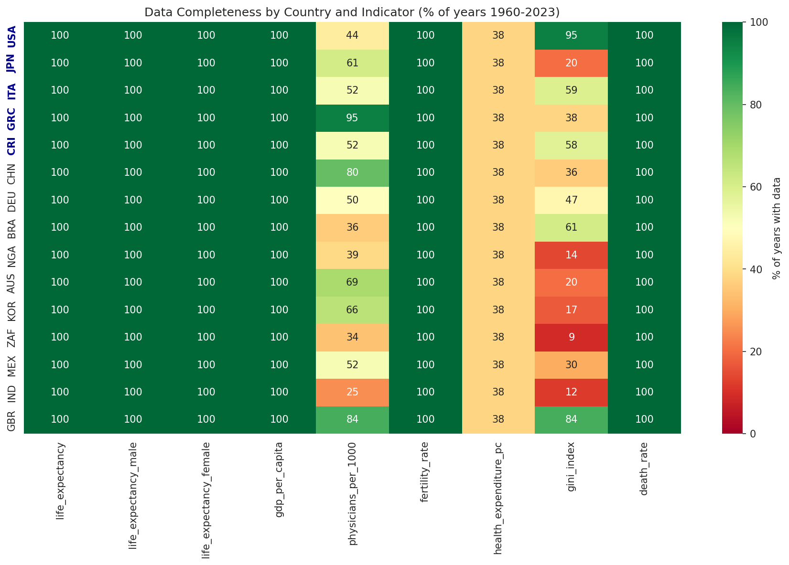

---

## Results

### H1: The Blue Zone Advantage is Real

Blue Zone countries have led the global average in every single year since 1960. This isn't marginal -- the gap was **10.0 years** in 1960 and still stands at **6.4 years** as of 2020.

| Year | Blue Zone Avg (years) | Global Avg (years) | Gap | Countries in sample |
|------|----------------------|-------------------|-----|---------------------|
| 1960 | 68.1 | 58.0 | **+10.0** | 92 |
| 1970 | 70.8 | 61.7 | **+9.0** | 93 |
| 1980 | 74.2 | 65.1 | **+9.1** | 93 |
| 1990 | 76.8 | 67.8 | **+9.0** | 93 |
| 2000 | 78.5 | 69.9 | **+8.6** | 93 |
| 2010 | 80.6 | 73.1 | **+7.6** | 93 |
| 2020 | 80.9 | 74.5 | **+6.4** | 93 |

**H1 is supported.** The advantage is persistent and has been present across the entire 64-year period.

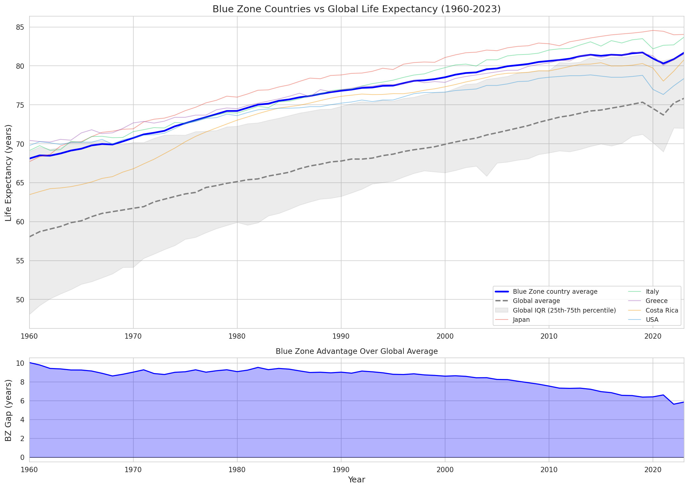

### H2: The World is Catching Up (Convergence Confirmed)

The gap shrank from 10.0 years to 6.4 years -- a **36% reduction** over six decades. This isn't because Blue Zone countries got worse. It's because the rest of the world improved faster.

Two independent convergence tests confirm this:

**Sigma convergence (is the global spread shrinking?):**

The standard deviation of life expectancy across all 93 countries dropped from **11.41 years** in 1960 to **6.36 years** in 2023. The coefficient of variation fell from 0.197 to 0.084. Countries are measurably becoming more similar in how long their people live.

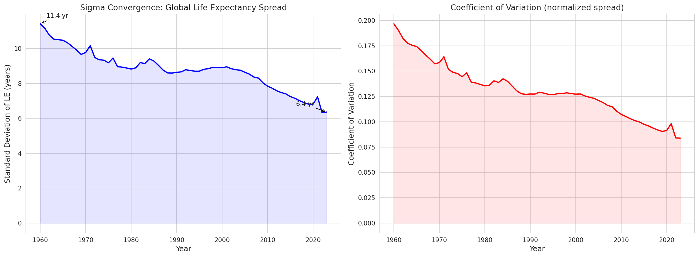

**Beta convergence (do lagging countries improve faster?):**

In 5 out of 6 decades, countries that started with lower life expectancy gained more years than countries that started higher. The correlation between starting life expectancy and subsequent decade gain is negative in every decade tested:

| Decade | Avg LE Gain | BZ Countries | Non-BZ Countries | Beta r | Convergence? |
|--------|------------|-------------|-----------------|--------|-------------|
| 1960s | +3.5 yr | +2.7 yr | +3.6 yr | -0.581 | Yes |
| 1970s | +3.4 yr | +3.5 yr | +3.4 yr | -0.450 | Yes |
| 1980s | +2.7 yr | +2.6 yr | +2.7 yr | -0.213 | Yes |
| 1990s | +2.2 yr | +1.7 yr | +2.2 yr | -0.088 | Weak |
| 2000s | +3.1 yr | +2.1 yr | +3.2 yr | -0.652 | Yes |
| 2010s | +1.5 yr | +0.3 yr | +1.5 yr | -0.569 | Yes |

The 2010s are particularly striking. Non-Blue Zone countries gained an average of **+1.5 years** that decade, while Blue Zone countries gained only **+0.3 years**. When you're already at 80+, the ceiling gets harder to push through.

**H2 is supported.** Global convergence is real and accelerating.

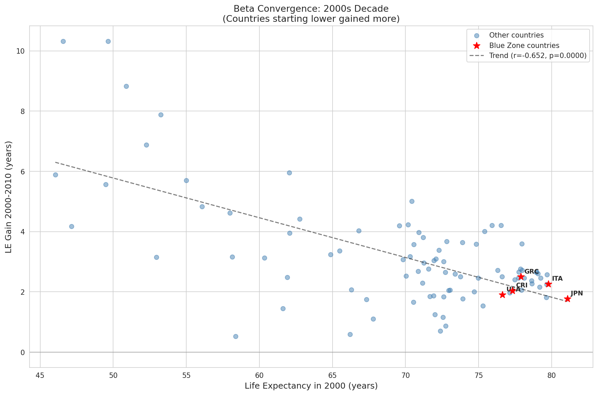

**H0 is rejected.** The difference is significant and the convergence trend is consistent.

---

## Decade-by-Decade Improvement Rates

This chart tells the convergence story visually. In most decades, non-Blue Zone countries outpaced Blue Zone countries in life expectancy gains:

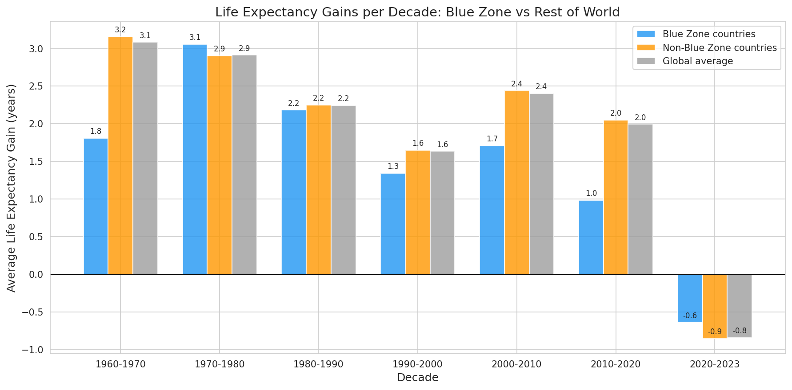

The 2010s stand out as the decade where Blue Zone country gains nearly flatlined. Japan, Italy, and Greece all plateaued around 80-84 years. Meanwhile, countries in Sub-Saharan Africa and South Asia continued rapid gains from a lower base.

---

## Individual Blue Zone Country Trajectories

Not all Blue Zone countries followed the same path.

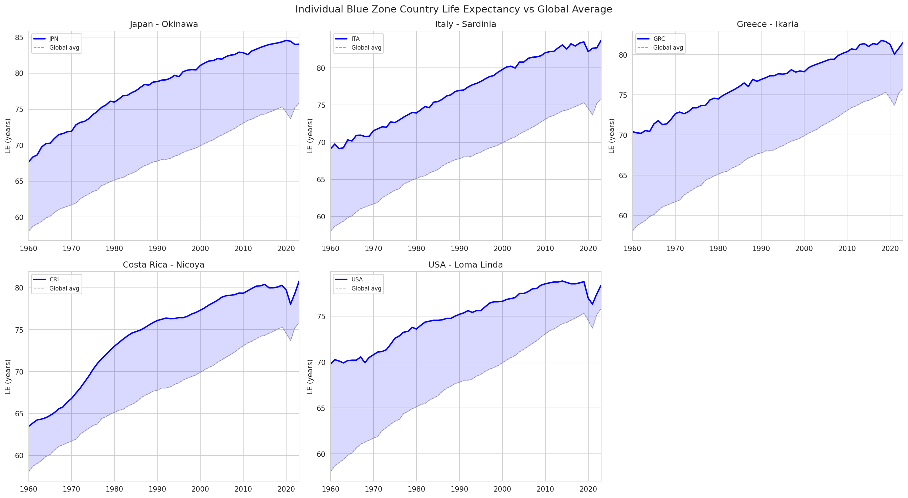

### Japan (Okinawa)
- **1960:** 68.2 years | **2020+:** 84.3 years | **Total gain:** +16.0 years
- The single highest life expectancy among all Blue Zone countries. Japan's trajectory is remarkably steep and consistent -- it passed every peer in East Asia and kept climbing. The gain of 16 years in 60 years is extraordinary.

### Italy (Sardinia)
- **1960:** 69.3 years | **2020+:** 82.8 years | **Total gain:** +13.5 years
- Tracks tightly with the Western European average. Italy doesn't dramatically outperform its neighbors -- the Sardinian Blue Zone advantage is a regional phenomenon that doesn't show up clearly at the national level.

### Greece (Ikaria)
- **1960:** 70.3 years | **2020+:** 80.9 years | **Total gain:** +10.6 years
- Started above the global average but has been overtaken by Japan and Italy. Greece's economic crises in the 2010s are visible in the data as a plateau.

### Costa Rica (Nicoya)
- **1960:** 63.9 years | **2020+:** 79.5 years | **Total gain:** +15.6 years
- The most impressive catch-up story. Costa Rica started 6 years below the other Blue Zone countries and nearly closed the gap entirely. This tracks with Costa Rica's well-documented investment in public health.

### United States (Loma Linda)
- **1960:** 70.1 years | **2020+:** 77.3 years | **Total gain:** +7.2 years
- The worst performer among Blue Zone countries by a wide margin. The US gained only 7.2 years over 60 years while Japan gained 16. The US is now being passed by countries that were far behind it in 1960. The Loma Linda community's longevity advantage is entirely invisible at the national level.

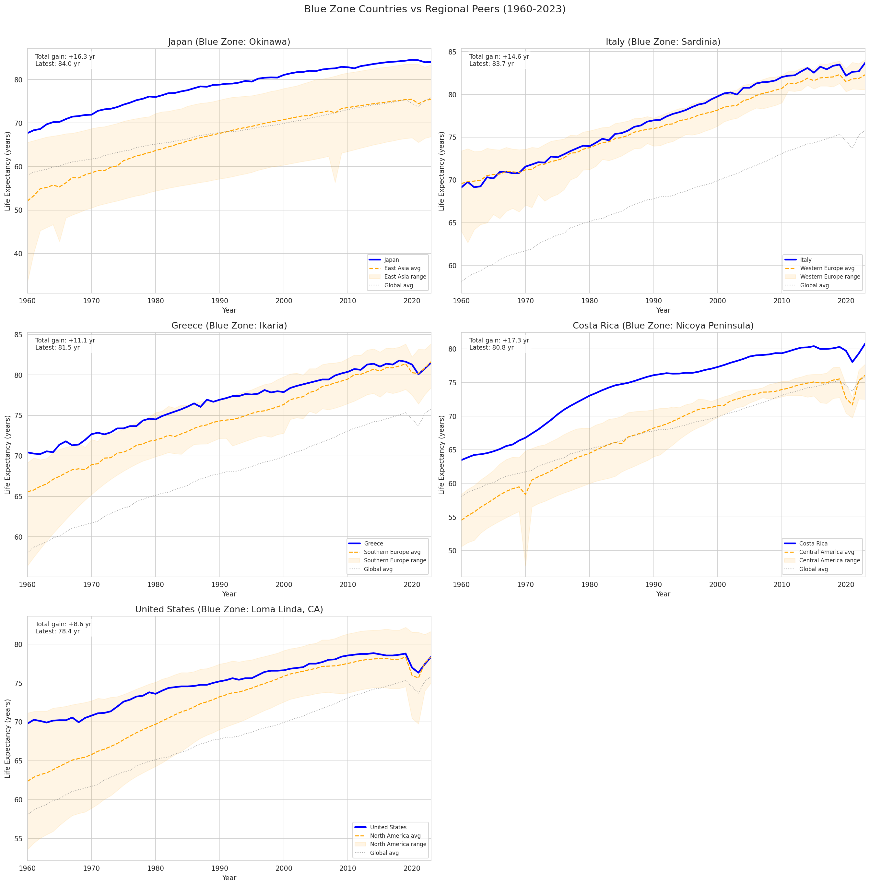

---

## GDP vs Life Expectancy

The relationship between wealth and longevity is real but has diminishing returns. Costa Rica achieves nearly the same life expectancy as the US at a fraction of the GDP per capita.

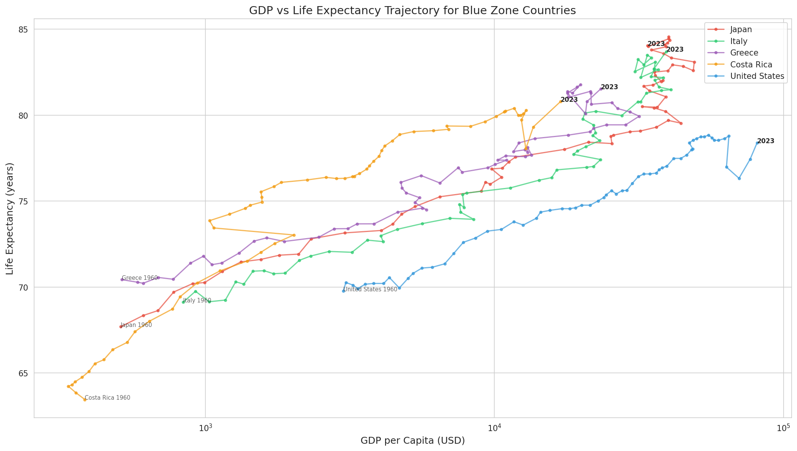

---

## Global Rankings Over Time

Where do Blue Zone countries rank among all 93 countries in life expectancy?

Japan has held a top-5 position for decades. The US has been sliding -- it was in the top quartile in the 1960s and has dropped steadily since.

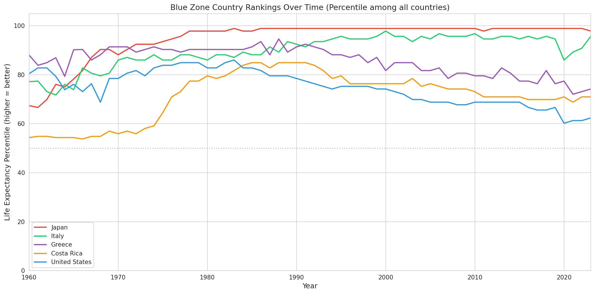

---

## Cross-Indicator Correlations

What actually correlates with life expectancy? Using the most recent data (2015+):

| Factor | Correlation with LE | Direction |
|--------|-------------------|-----------|
| Physicians per 1,000 population | r = +0.783 | More doctors, longer lives |
| Urbanization (%) | r = +0.680 | More urban, longer lives |
| GDP per capita | r = +0.678 | Wealthier, longer lives |
| Health expenditure per capita | r = +0.641 | More health spending, longer lives |
| PM2.5 air pollution | r = -0.556 | More pollution, shorter lives |

Physician density is the single strongest correlate. Not GDP, not health spending -- it's having enough doctors.

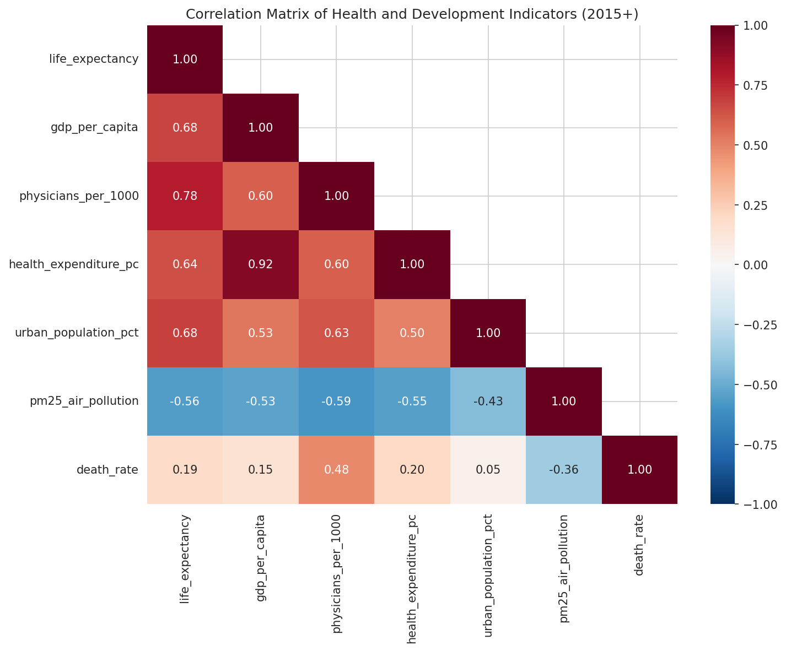

---

## Global Life Expectancy Distribution Over Time

The histograms below show how the global distribution of life expectancy has shifted and compressed over 60 years. The red lines mark Blue Zone countries. In 1960, they were outliers. By 2020, much of the world has caught up to where they were.

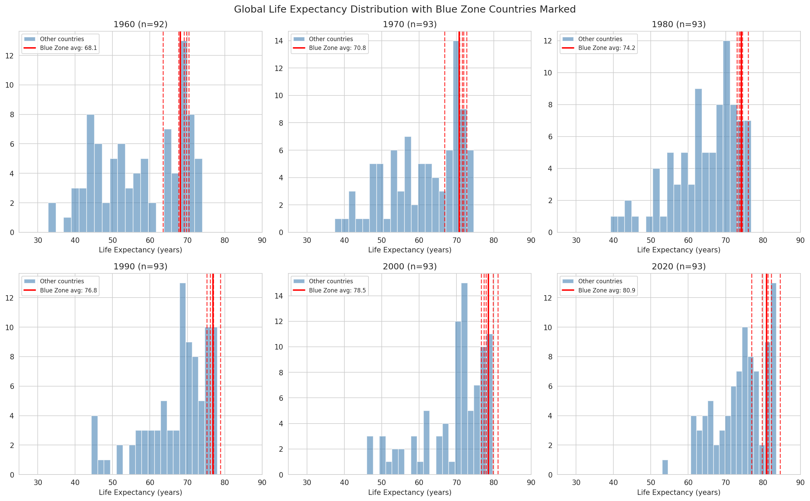

---

## Global Heatmap

Life expectancy across all 93 countries and all years, with Blue Zone countries highlighted:

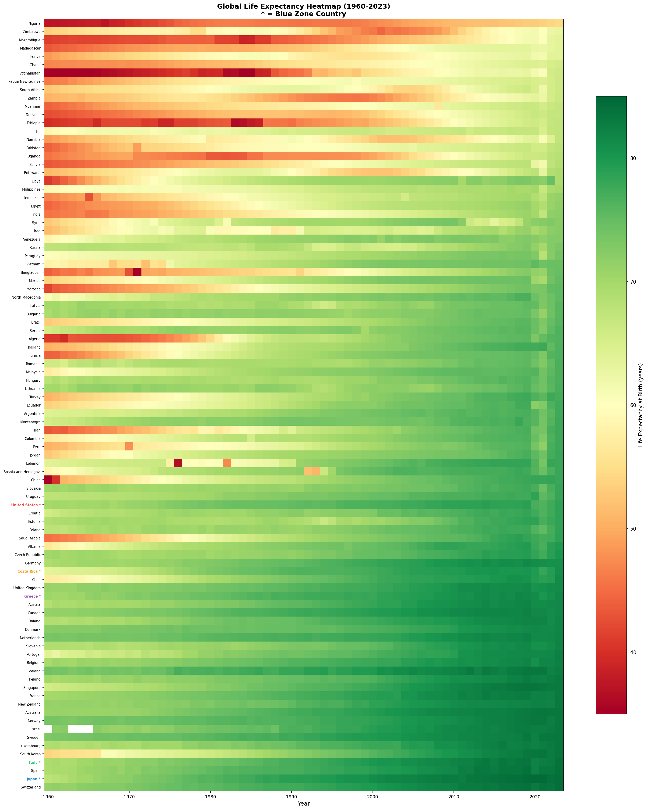

---

## Projections (2024-2100)

Life expectancy projections through 2100, extrapolated from real historical trends with logistic dampening (approaching a theoretical ceiling around 95 years). These are not UN projections -- the UN Population Division API was unavailable at collection time. These are trend-based estimates with Medium, High, and Low scenarios reflecting growing uncertainty over time.

| Country | 2050 Medium | 2050 Range | Source |
|---------|------------|------------|--------|
| Japan | 84.5 yr | 82.6 - 86.3 | Trend extrapolation |
| Italy | 84.2 yr | 82.3 - 86.0 | Trend extrapolation |
| Greece | 82.0 yr | 80.2 - 83.8 | Trend extrapolation |
| Costa Rica | 81.1 yr | 79.2 - 82.9 | Trend extrapolation |
| United States | 78.4 yr | 76.6 - 80.3 | Trend extrapolation |

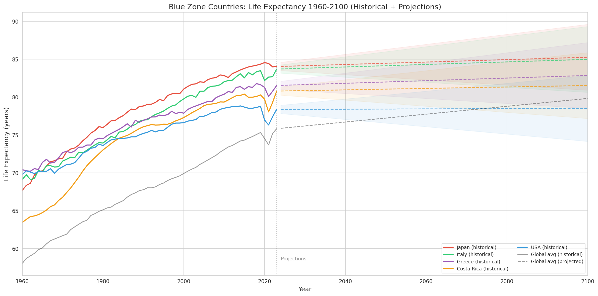

The projected Blue Zone advantage continues to narrow:

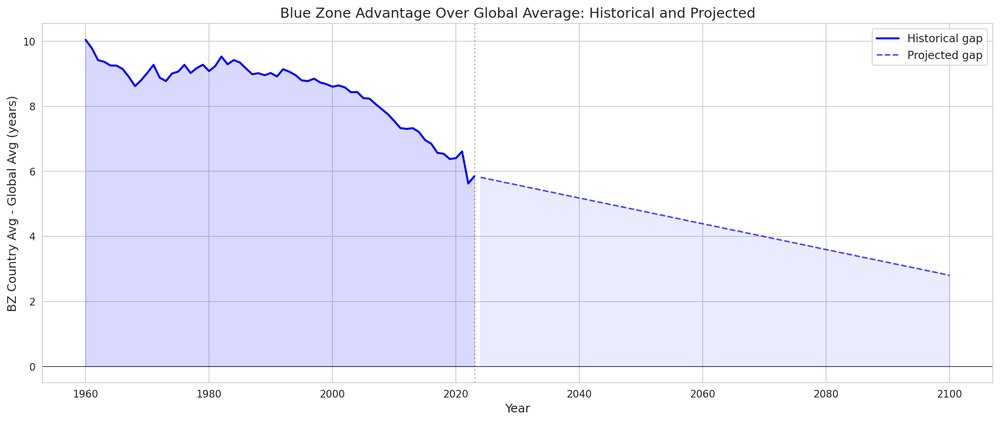

Japan's projection with uncertainty band:

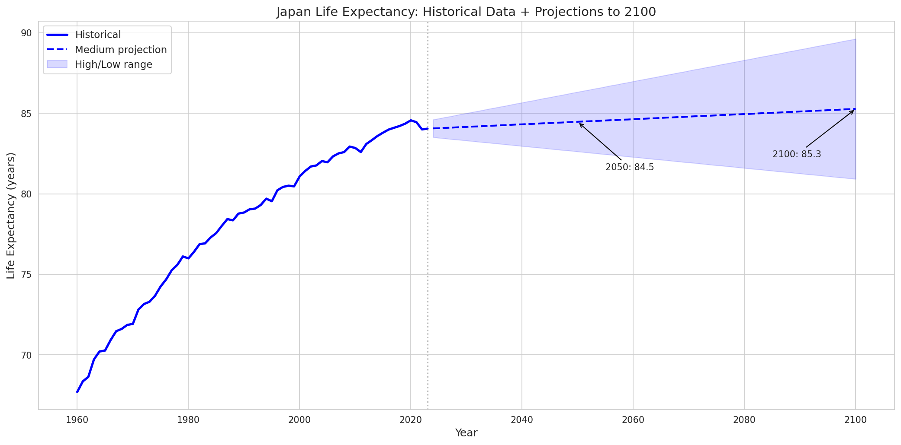

---

## Limitations

This analysis has real constraints that should be taken seriously:

1. **The fundamental country-vs-region problem.** Blue Zones are neighborhoods and villages, not nations. Okinawa is not Japan. Loma Linda is not the United States. Country-level data is the best publicly available longitudinal data, but it dilutes the Blue Zone signal. Any conclusions here are about countries *containing* Blue Zones, not about the zones themselves.

2. **Data gaps.** Life expectancy coverage is excellent (100% for Blue Zone countries). Other indicators are spottier -- PM2.5 data only starts around 2000, health expenditure is inconsistent before the 1990s. The analysis uses what's available and notes where gaps exist.

3. **Projection caveats.** The projections to 2100 are trend extrapolations, not expert forecasts. They assume no major pandemics, wars, or medical breakthroughs. They should be treated as "what if current trends continue" scenarios, not predictions.

4. **Correlation is not causation.** Physician density correlating with life expectancy does not prove that adding doctors increases lifespan. Every correlation reported here is observational.

5. **Sample composition.** The 93-country sample skews toward larger nations with robust statistical agencies. Small island nations and fragile states with potentially interesting longevity patterns may be absent.

6. **The Okinawa question.** Recent research suggests Okinawa's longevity advantage has been declining since the 1970s due to dietary westernization. Country-level data for Japan cannot capture this -- Japan's national LE kept rising even if Okinawa's regional advantage eroded.

---

## Methodology

### Data Collection
- **World Bank API:** REST calls for 9 indicators with proper pagination (the API returns `[metadata, data_array]` format, which many collectors handle incorrectly)
- **WHO GHO API:** 3 additional health indicators with full historical coverage
- **Rate limiting:** 0.2s between API calls to avoid throttling
- **Merge strategy:** ISO3 country codes (not country names, which fail on "Korea, Rep." vs "South Korea" mismatches)

### Analysis
- **Gap analysis:** Unweighted mean of Blue Zone country LE minus unweighted global mean, per year
- **Sigma convergence:** Standard deviation of LE across all countries, per year
- **Beta convergence:** Pearson correlation between decade-start LE and decade LE gain, per decade
- **Projections:** Logistic trend extrapolation with dampening (ceiling at ~95 years), uncertainty grows linearly with time horizon

### Reproducibility
Every step is scripted and can be re-run:
```bash
python historical_data_collector.py    # Pulls fresh data from APIs
python un_projections_collector.py     # Generates projections
python historical_trend_analysis.py    # Runs all analyses
python projection_visualizer.py        # Generates figures
python verify_data_quality.py          # Validates data integrity
python generate_report.py              # Builds markdown report
```

---

## Interactive Dashboard

The full analysis is available as an interactive Streamlit dashboard with filterable charts, data downloads, and drill-down capability:

**[Launch the Live Dashboard](https://xxremsteelexx-blue-zones-longevity--blue-zones-dashboard-xgbvew.streamlit.app/)**

To run locally:
```bash
pip install streamlit plotly pandas numpy
streamlit run blue_zones_dashboard.py
```

---

## Project Structure

```
Blue-Zones-Longevity-Analysis/
├── historical_data_collector.py         # World Bank + WHO data collection
├── un_projections_collector.py          # Projection generator
├── historical_trend_analysis.py         # Convergence and trend analysis
├── projection_visualizer.py             # Static figure generation
├── generate_report.py                   # Report generator
├── verify_data_quality.py               # Automated quality checks
├── blue_zones_dashboard.py              # Interactive Streamlit dashboard
│
├── data/
│   ├── historical/
│   │   └── merged_historical_panel.csv  # 5,952 rows, main dataset
│   └── projections/
│       └── un_life_expectancy_projections.csv  # 7,161 rows, to 2100
│
├── notebooks/
│   ├── 01_Data_Exploration.ipynb        # Dataset overview
│   ├── 02_Historical_Trends.ipynb       # BZ vs global over time
│   ├── 03_Convergence_Analysis.ipynb    # Sigma and beta convergence
│   ├── 04_Country_Deep_Dives.ipynb      # Individual country profiles
│   └── 05_Projections_Analysis.ipynb    # Future projections
│
└── outputs/
    ├── analysis/                        # 5 result CSVs
    └── figures/                         # 25 charts
```

---

## Conclusions

The data tells a clear story.

Blue Zone countries have had a real and persistent life expectancy advantage for at least 64 years. But the rest of the world is closing the gap. In 1960, Blue Zone countries were 10 years ahead. By 2020, that lead had shrunk to 6.4 years. The convergence is driven by rapid gains in developing countries -- not by Blue Zone countries declining.

The most striking finding is the US. Among the five Blue Zone countries, the United States gained the least life expectancy over 60 years (+7.2 years vs Japan's +16.0), and it's the only one whose global ranking has been falling. Whatever Loma Linda is doing right, it's not showing up in the national numbers.

If current trends hold, projections suggest the global average will reach today's Blue Zone levels (around 80 years) by the late 2060s.

---

## Acknowledgments

- Dan Buettner and National Geographic for identifying and documenting the Blue Zones
- World Bank Open Data for maintaining accessible development indicator APIs
- World Health Organization Global Health Observatory for health statistics
- UN Population Division for demographic methodology and frameworks

---

*Last updated: February 2026*
